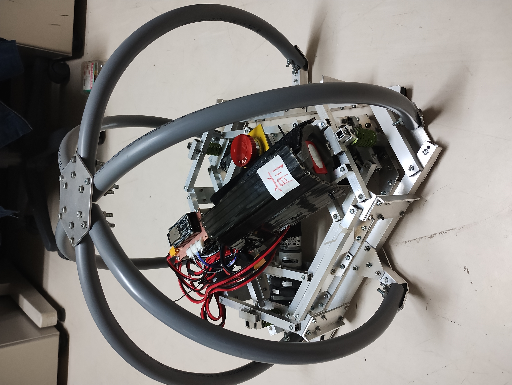
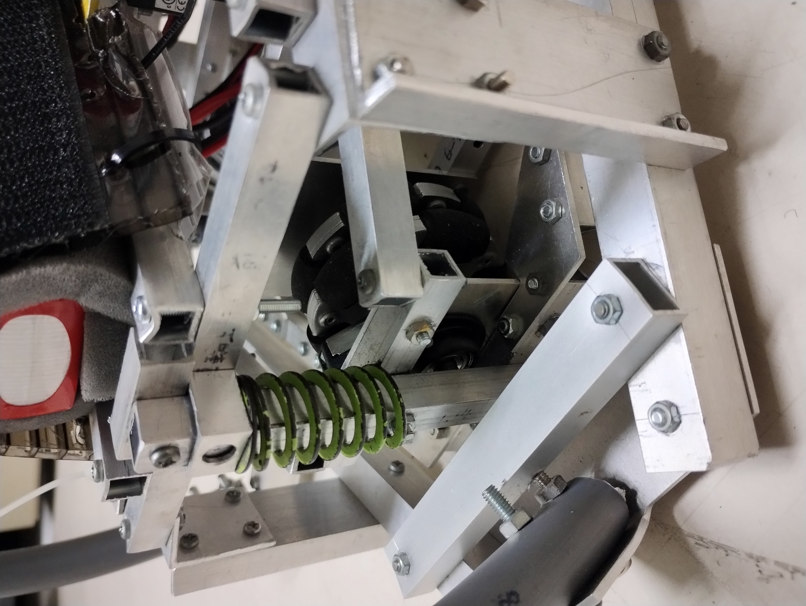
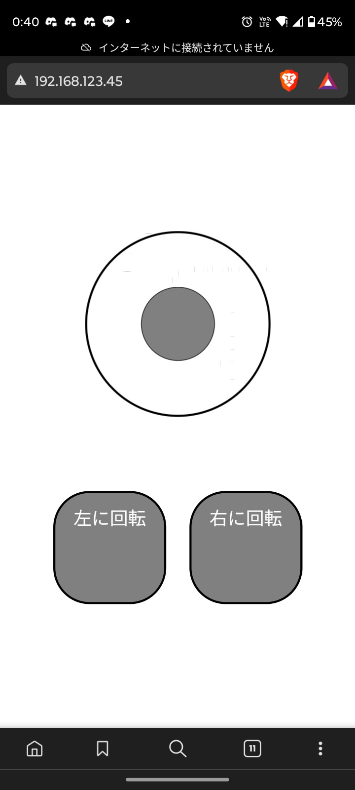

# ロボットの概要

## 制作理由
　このロボットは、高専ロボコンが終わってから、部内ロボコンをしようという流れになり、それに出場したものだ。また、設計・回路・制御のすべて一人で行った。加工に関しては、実習工場の先生方にアルミ板のマシニングセンタでの加工を手伝ってもらった。

## このロボットの仕様
　このロボットは、今年のNHK高専ロボコンに出場したロボットの中のAチームのR1で射出され、その後風船を割るというルールだった。

（下の写真は割る機構は取り外してある。）

## 塩ビ管を用いて転がる
　このロボットは射出される。すなわち、どこから落ちても大丈夫じゃないといけない。だからといって全面に車輪をつけるわけには行かない。なので、上の写真のように塩ビ管を曲げたものを6本とりつけた。これを取り付けることで、どこから着地しても、転がって車輪が下になる。

### サスペンション

　このルールを受け、ロボットは、ある程度の強度があり射出されても壊れず、その後きちんと走行できる必要があった。また、操縦がしやすいという点でオムニホイールを使った。しかし、オムニホイールは構造が複雑なため、壊れやすい。投げるなどもってにほかだ。それをサスペンションを組み込むことでカバーした。

## 制御基板

　モータ（Mabuchi RS385)を動かすためのモータドライバは、Cytron が作っている既製品だ。これに合わせてESP32 を載せた制御基板を作った。大きさをモータドライバに合わせることで、棚状に固定できる。こうすることで、コンパクトかつ、指し間違えのない設計ができる。

## スマホ操作
　なぜスマホ操作を選んだか?しそれはもちろんかっこいいから。

　スマホやタブレットでロボットを操縦することが憧れだった。しかも高い壁があるかと思っていたが、実際書いてみたら、既存のライブラリを使ってでのGUI制作は簡単だとわかった。

## 制作工程
- 設計：FUSION 360 を用いて3Dでせっけい。期間は、3〜4日かかった
- 回路：部内ロボコンのときには写真とは別の基盤を使っていたが、それぞれKi-CAD を用いて設計し、LPKF で基盤を加工した。期間はそれぞれ1日
- 制御：一番苦戦した。主に VS Code のPlatform io という機能でESP32 に書き込んだ。プログラムの書き方に苦戦し、部内ロボコンまでに間に合いそうになかったので、部内ロボコンに出たときは、同級生の制御班の人に書いてもらったが、終わったあとにきちんと自分のプログラムに書き直して、動くようにした。期間：1ヶ月くらい
